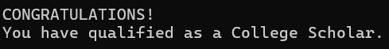
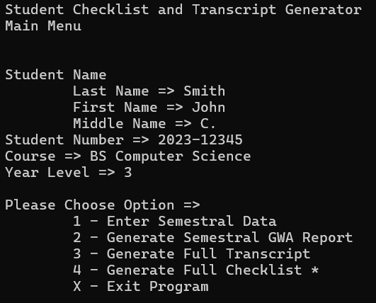
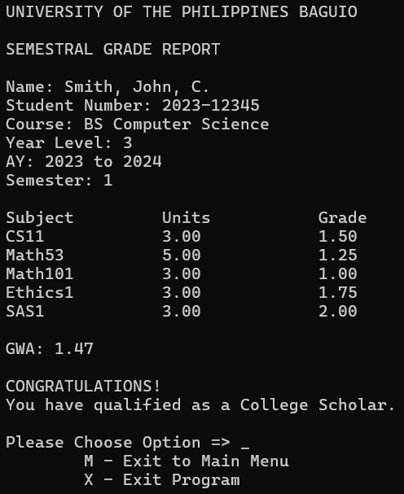

## Student GWA Generator
> Input your academic details and grades to generate a transcript for each academic year and semester.  
> Automate the calculation of your grades!

### Description
*Originally made on 03/12/2024.*  
This program was made as a partial requirement for CS 11, entirely in C.  
The grading scheme is based on the University of the Philippines system. 

### Features and Functions
- Input academic information and saves it when generating semestral grades
- Automatic calculation of grades for each semester and academic year
- View transcript of specific semester and academic year
- Checks if the GWA qualifies for a Dean's List or Semestral Honors

    

### *Notes*
- *Please do not include spaces when inputting a subject. It will not prompt the user to input the units.*
- *Inputted data does not save when the application is closed.*

### Screenshots
Main Menu:

    

Semestral Grade Report:

    

